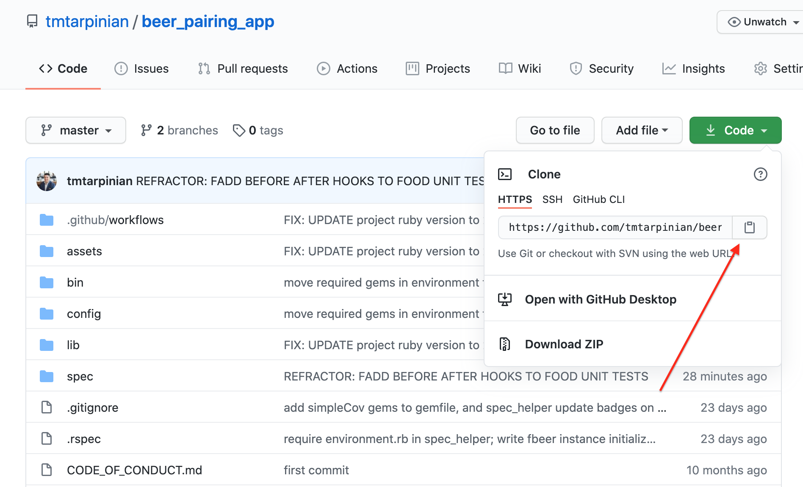
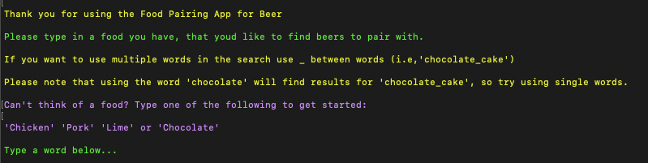

# Beer-Pairing App for Food
> Fetches beers from PunkAPI that pair with your food.

### Table of Contents

- [Summary](#Summary)
- [Dependencies](#Dependencies)
    - [Ruby](###Ruby)
        - [Changing Ruby Versions](####Changing_Versions)
        - [Installing Ruby Versions](####Installing_Versions)
    - [Open-URI](###Open-URI)
    - [JSON](###JSON)
    - [Colorize](###Colorize)
- [Run](#Run)
- [Acknowledgements](#Acknowledgements)
- [Contributing](#Contributing)
- [Code of Conduct](#Conduct)
- [Maintainers](#Maintainer(s))
- [License](#license)

---
## Summary
This program was created to help people find beers that pair with food they currently have in the house or on their grocery list.

By choosing a food, the app will find beers that pair with that food. The beers will also provide descriptions of meals you can create from those foods, giving you not only beer ideas but dinner ideas as well.

With this instant knowledge on hand, you'll soon be creating remarkable beer pairings that excites your normal meal routine and impresses any guest.

---
## Dependencies

The following requirements are necessary to run these files:
- Ruby ~>2.7.0
- Open-URI
- json
- Colorize gem
---

### Ruby

This app is written with Ruby and requires Ruby version ~>2.6.1 to be installed on the operating system executing the program.

#### Changing_Versions
If Ruby is installed on your system, verify the currently used version with the command `ruby -v`

You can list all installed Ruby versions on your machine with `rvm list`

Changing the currently used version of Ruby to a version ~>2.7.0 can be achieved with the command `rvm use 2.7.0` (or your specified version).

Running `rvm list` again will confirm that that version is the current

#### Installing_Versions
If you do not have a version of Ruby version  ~>2.7.0 on your machine you, can obtain it by running `rvm install 2.7.0`.

This installation requires `Ruby Version Manager` (RVM). If RVM is not installed on your machine, that can be downloaded and installed with the following command:

`curl -sSL https://get.rvm.io | bash`

When RVM is installed, run `rvm reload` or close and reopen your terminal to make sure RVM is fully loaded. Next, install the Ruby version ~>2.6.1 with the subsequent commands:

`rvm install 2.7.0`
`rvm use 2.7.0`

Please see the [Ruby installation instructions](https://www.ruby-lang.org/en/documentation/installation/) for further information about installing RVM or a Ruby verion on your machine.

### Open-URI

[net/http Documentation](https://ruby-doc.org/stdlib-2.7.1/libdoc/net/http/rdoc/Net/HTTP.html)

### JSON
[json Documentation](https://ruby-doc.org/stdlib-2.6.3/libdoc/json/rdoc/JSON.html)

### Colorize
Finally, the app uses the [Colorize](https://github.com/fazibear/colorize) gem.

To install, in your terminal, run `gem install colorize`.
[Find the Colorize documentation here](https://github.com/fazibear/colorize)

---

## Run

To run any of the files, [visit the file's repo on Github](https://github.com/tmtarpinian/beer_pairing_app).

From there, download a zipped copy of the repo files or use its web url to clone.
 

Please have ruby and the above gem dependencies installed prior to running this application ([see dependencies above](##Dependencies))

After unzipping and saving the contents to the desired directory (or using `git clone` to clone the repo in your terminal), change directories to the directory containing the copy of the repo.

From within that directory, run the following command in your terminal:
`ruby ./bin/beer_pairing`

The program will run and prompt the user for input with the following message:
 

To close the program, type the word `exit`

---

## Acknowledgements

I would like to thank PunkAPI.com for allowing public access to their API and for the extensive information they provide.

[Please check out their API](https://punkapi.com/).

Photo credit: [Timothy Dykes](https://unsplash.com/@timothycdykes?utm_source=unsplash&amp;utm_medium=referral&amp;utm_content=creditCopyText)

---
## Contributing

Bug reports and pull requests are welcome on GitHub at https://github.com/ferrisbueller66/beer_pairing_app. This project is intended to be a safe, welcoming space for collaboration, and contributors are expected to adhere to the [Contributor Covenant](http://contributor-covenant.org) code of conduct.

---
## License

The gem is available as open source under the terms of the [MIT License](https://opensource.org/licenses/MIT).

---
## Maintainer(s)

|      |
| :------------- | 
|[@tmtarpinian](https://github.com/tmtarpinian) |

## Conduct

Everyone interacting in the Beer-Pairing App’s codebases, issue trackers, chat rooms and mailing lists is expected to follow the [code of conduct](https://github.com/tmtarpinian/beer_pairing_app/blob/master/CODE_OF_CONDUCT.md).
